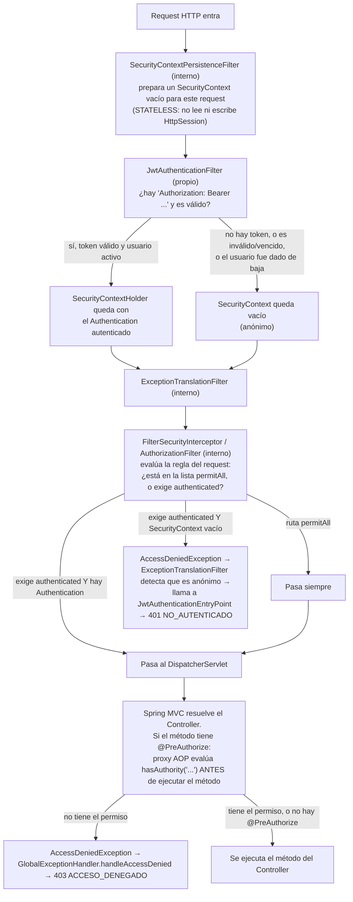
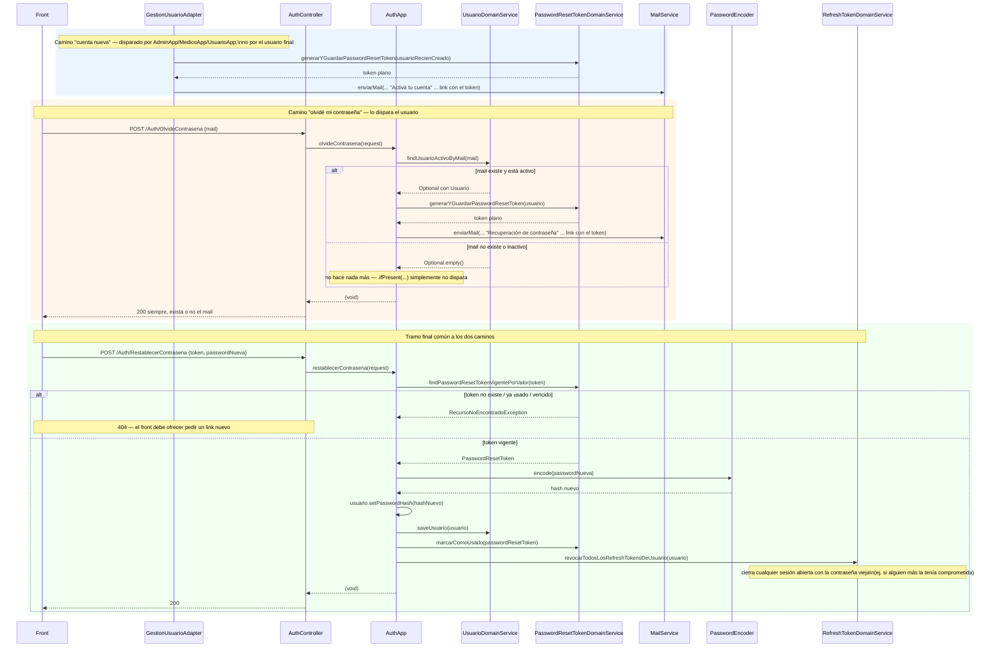

# Seguridad — Spring Security en AccesMed

Este documento es una guía para **entender Spring Security a través de este proyecto**: qué
hace cada clase de `Security/`, cómo encajan entre sí, y cómo un request HTTP se convierte
en "este usuario está autenticado y tiene permiso para hacer esto". No repite el contrato
de API (eso está en `Docs/Features/Autenticacion.md` y `UsuariosRolesYPermisos.md`) ni las
decisiones de arquitectura de carpetas (`Docs/ARQUITECTURA.md`) — se enfoca en el
**mecanismo**: qué hace Spring Security en general, y qué hace específicamente cada clase
de este backend para usarlo.

---

## 1. Spring Security en 10 minutos (los conceptos que hay que tener para leer el resto)

Spring Security protege una aplicación con **filtros** (`javax.servlet.Filter`/
`jakarta.servlet.Filter`) que se ejecutan **antes** de que el request llegue al
`DispatcherServlet` de Spring MVC (o sea, antes que a cualquier `@Controller`). Todos esos
filtros están encadenados en una `SecurityFilterChain`, registrada en el servlet container
mediante un único filtro "paraguas" que Spring Boot instala automáticamente
(`FilterChainProxy`, vía `DelegatingFilterProxy`) — esto es autoconfiguración, no hay una
clase propia del proyecto que lo haga.

Las piezas que hay que conocer, en el orden en que aparecen en este documento:

| Concepto | Qué es | Dónde vive en este proyecto |
|---|---|---|
| **`Authentication`** | Objeto que representa "quién hizo este request" — antes de autenticar, lleva las credenciales crudas; después, la identidad resuelta + sus permisos. | `UsernamePasswordAuthenticationToken` (tipo estándar de Spring, no hay clase propia) |
| **`SecurityContext` / `SecurityContextHolder`** | Donde vive el `Authentication` del request actual. Es un `ThreadLocal`: cada hilo (cada request, en un servlet container clásico) tiene el suyo. | Se llena en `JwtAuthenticationFilter` |
| **`UserDetails`** | La interfaz que Spring Security necesita para saber "quién es este usuario": username, password (hasheado), authorities, y 4 flags de estado (enabled, account-non-expired, etc.). | `UsuarioDetails` (adapter sobre la entidad `Usuario`) |
| **`UserDetailsService`** | Contrato de una sola función: dado un username (acá, el mail), devolver su `UserDetails`. | `UsuarioDetailsService` |
| **`GrantedAuthority`** | Un permiso, como string. Spring Security no sabe nada de "roles" ni "permisos de negocio": todo es una lista plana de strings que se comparan contra lo que pide `@PreAuthorize`/`hasAuthority(...)`. | `SimpleGrantedAuthority(permiso.name())`, construidas en `UsuarioDetailsService` |
| **`PasswordEncoder`** | Hashea y verifica contraseñas. Nunca se compara texto plano. | Bean `BCryptPasswordEncoder` en `SecurityFilterChainConfig` |
| **`AuthenticationManager` / `AuthenticationProvider`** | El que efectivamente autentica: recibe un `Authentication` con credenciales crudas y devuelve uno autenticado (o tira `AuthenticationException`). Por default, Spring Boot arma un `DaoAuthenticationProvider` que usa el `UserDetailsService` + `PasswordEncoder` que encuentre en el contexto — **no hay una clase propia que lo haga**, es autoconfiguración (ver log al arrancar: `"Global AuthenticationManager configured with UserDetailsService bean with name usuarioDetailsService"`). | Bean expuesto (no implementado) en `SecurityFilterChainConfig.authenticationManager(...)` |
| **`SecurityFilterChain`** | La lista ordenada de filtros + las reglas de qué rutas requieren qué. Se arma con el DSL de `HttpSecurity`. | `SecurityFilterChainConfig.securityFilterChain(...)` |
| **`OncePerRequestFilter`** | Clase base de Spring Security para escribir un filtro propio que se garantiza ejecutar una sola vez por request (incluso con forwards internos). | `JwtAuthenticationFilter` |
| **`AuthenticationEntryPoint`** | Se dispara cuando un request **no autenticado** llega a un recurso protegido — decide qué responder (por default, sin configurarlo, Spring Security cae a un 403 sin cuerpo). | `JwtAuthenticationEntryPoint` |
| **`AccessDeniedException`** | La tira Spring Security (método `@PreAuthorize` o la regla `.authorizeHttpRequests(...)`) cuando el usuario **sí** está autenticado pero no tiene el permiso. Este proyecto la atrapa en `GlobalExceptionHandler`, no con un `AccessDeniedHandler` de Security — ver §6. | — |
| **Method Security (`@EnableMethodSecurity` + `@PreAuthorize`)** | Un mecanismo *aparte* del filter chain: usa AOP (un proxy alrededor del bean) para interceptar la llamada al método del Controller y evaluar la expresión SpEL (`hasAuthority('...')`) antes de dejarlo ejecutar. | Anotación en cada método de cada `Controller` |

**La idea central de todo el capítulo de autenticación de este proyecto**: el JWT es
**liviano** — solo lleva el id del usuario (`sub`), nunca roles ni permisos. Eso significa
que **en cada request** hay que volver a la base a calcular qué puede hacer ese usuario
(`UsuarioDetailsService.loadUserByUsername`). Es más trabajo por request, pero la ventaja es
enorme: si a alguien le cambian el rol o lo dan de baja, el efecto es inmediato — no hay que
esperar a que expire un token de 30 minutos.

---

## 2. Mapa de `Security/` — qué hay y por qué está separado del núcleo

```
Security/
├── Application/
│   ├── AuthApp.java              # caso de uso: login, refresh, logout, recuperar/restablecer contraseña
│   └── GestionUsuarioAdapter.java # implementa el puerto que usa el núcleo (Medico/Admin) para provisionar usuarios
├── Config/
│   └── SecurityFilterChainConfig.java  # arma la SecurityFilterChain, y los beans PasswordEncoder/AuthenticationManager
├── Controllers/
│   └── AuthController.java       # login, refresh, logout, recuperación/restablecimiento y autoservicio de contraseña/mail
├── Domain/
│   ├── RefreshToken.java         # artefacto de sesión (no dato de negocio)
│   ├── PasswordResetToken.java   # artefacto de sesión (no dato de negocio)
│   └── CambioMailToken.java      # artefacto de sesión: confirma un cambio de mail contra el mail nuevo
├── Jwt/
│   ├── JwtService.java               # generar/validar el JWT
│   ├── JwtAuthenticationFilter.java  # el filtro que lee el header Authorization en cada request
│   ├── JwtAuthenticationEntryPoint.java # qué responder si el request no está autenticado
│   ├── UsuarioDetails.java           # adapter Usuario → UserDetails
│   └── UsuarioDetailsService.java    # recalcula authorities desde la base en cada request
├── Records/Auth/
│   ├── Request/  (LoginRequest, RefreshRequest, OlvideContrasenaRequest, RestablecerContrasenaRequest,
│   │              CambiarMailRequest, ConfirmarCambioMailRequest)
│   └── Response/ (LoginResponse, RefreshResponse)
├── Repositories/
│   ├── RefreshTokenRepository.java
│   ├── PasswordResetTokenRepository.java
│   └── CambioMailTokenRepository.java
└── Services/
    ├── DomainServices/
    │   ├── RefreshTokenDomainService.java       # generar, validar, revocar refresh tokens
    │   ├── PasswordResetTokenDomainService.java # generar, validar, consumir tokens de activación/recuperación
    │   └── CambioMailTokenDomainService.java    # generar, validar, consumir tokens de cambio de mail
    └── Utils/
        ├── AlcanceMedicoService.java   # scope "solo mis recursos" para un médico
        └── AutorizacionService.java    # permiso extra condicional dentro de un método
```

**Por qué `Usuario`/`Rol`/`UsuarioRol`/`Admin` NO están acá** (viven en `Domain/`,
`Application/`, `Services/*` del **núcleo**, junto a `Medico`/`Turno`): son datos de
negocio ("quién existe y qué puede hacer"), no mecanismo de sesión. `Security/` se reserva
para lo que es **específico de JWT y reemplazable**: si mañana se cambia el mecanismo de
sesión (a cookies, a OAuth2, a lo que sea), se reemplaza esta carpeta entera sin tocar el
modelo de usuarios. El detalle completo de esa decisión está en
`Docs/ARQUITECTURA.md` ("`Security` es mecanismo, no dato de negocio"). Ver también
`Docs/Features/UsuariosRolesYPermisos.md` para el CRUD de `Usuario`/`Rol`/`Admin`.

**El cruce entre las dos mitades es un puerto** (inversión de dependencia): el núcleo
declara `Application/Ports/GestionUsuarioPort` (qué necesita de `Security`), y
`Security/Application/GestionUsuarioAdapter` lo implementa. Así ningún `App` del núcleo
importa nada de `Security` — solo la interfaz.

---

## 3. Catálogo de clases

### 3.1 `Jwt/` — el mecanismo de token

#### `JwtService`

Genera y valida el JWT. Es la única clase que sabe firmar/verificar — nadie más en el
proyecto toca la librería `jjwt` directamente.

| Atributo | Tipo | De dónde sale |
|---|---|---|
| `secret` | `String` | `@Value("${accesmed.jwt.secret}")` — obligatorio, sin default (`application.yml`: `${ACCESMED_JWT_SECRET}`) |
| `expirationMinutes` | `long` | `@Value("${accesmed.jwt.expiration-minutes}")` — default `30` |

| Método | Qué hace |
|---|---|
| `generateToken(UsuarioDetails)` | Arma un JWT compacto: `subject` = `usuarioId.toString()`, `issuedAt` = ahora, `expiration` = ahora + `expirationMinutes`, firmado con `signWith(getSigningKey())`. **No pone roles ni permisos** — es la decisión de diseño "JWT liviano" (§1). |
| `extractUsuarioId(String token)` | Parsea el token y devuelve el `subject` como `UUID`. Asume que ya se validó con `isTokenValid` — no vuelve a chequear firma/expiración por su cuenta (`parseClaims` sí lo hace, pero si algo falla acá deja propagar la excepción). |
| `isTokenValid(String token)` | Intenta `parseClaims(token)`; si no tira `JwtException`/`IllegalArgumentException`, es válido. Cubre firma inválida, token malformado **y expiración** (la librería `jjwt` tira `ExpiredJwtException`, subtipo de `JwtException`, si `exp` ya pasó). |
| `getSigningKey()` *(privado)* | `Keys.hmacShaKeyFor(secret.getBytes(UTF_8))` — deriva la clave HMAC del secreto configurado. Firma simétrica: la misma clave firma y verifica (no hay par público/privado). |

#### `JwtAuthenticationFilter extends OncePerRequestFilter`

El filtro que se ejecuta en **todos** los requests (está agregado a la cadena con
`.addFilterBefore(jwtAuthenticationFilter, UsernamePasswordAuthenticationFilter.class)` —
ver §3.3). Su trabajo es sencillo: si hay un JWT válido en el header, deja el usuario
autenticado en el `SecurityContext` **para el resto de ese request**. Si no hay token, o es
inválido, no hace nada — deja pasar el request sin autenticar, y quien decide qué pasa
después es la regla de autorización (`.anyRequest().authenticated()` en
`SecurityFilterChainConfig`, que termina en `JwtAuthenticationEntryPoint`).

| Dependencia | Para qué |
|---|---|
| `JwtService` | validar el token y extraer el id de usuario |
| `UsuarioDetailsService` | recalcular las authorities frescas |
| `UsuarioDomainService` (del núcleo) | confirmar que el usuario **sigue activo** (no dado de baja) |

`doFilterInternal(request, response, filterChain)`:
1. Lee el header `Authorization`. Si no existe o no empieza con `"Bearer "`, sigue la
   cadena sin tocar nada (`filterChain.doFilter(...)`) — un endpoint público (los de
   `/Auth/*` en la lista `permitAll()`) nunca necesita pasar por acá.
2. Si `jwtService.isTokenValid(token)` **y** todavía no hay nadie autenticado en el
   contexto (`SecurityContextHolder.getContext().getAuthentication() == null` — evita
   pisar una autenticación que ya haya puesto otro mecanismo antes en la cadena):
   - `usuarioDomainService.findUsuarioActivoById(usuarioId)` — si el usuario fue dado de
     baja, esto tira `RecursoNoEncontradoException` y cae al `catch` de abajo. **Este es
     el chequeo que hace que un baneo tenga efecto inmediato**, incluso con un access
     token todavía sin vencer (ver §5.4).
   - `usuarioDetailsService.loadUserByUsername(usuario.getMail())` — recalcula las
     authorities desde la base, no las lee de ningún lado cacheado.
   - Arma un `UsernamePasswordAuthenticationToken(userDetails, null, authorities)` (el
     `null` es la credencial — no hace falta, ya está autenticado) y lo pone en
     `SecurityContextHolder.getContext().setAuthentication(authToken)`.
3. Cualquier excepción en ese bloque (`Exception` genérico) se atrapa y se loguea en
   `debug` — **a propósito no se propaga**: un token roto no debe tirar un 500, debe
   simplemente dejar el request sin autenticar y que el flujo normal de autorización
   (§3.3/§6) decida el 401.
4. Sigue la cadena (`filterChain.doFilter(...)`) pase lo que pase.

#### `UsuarioDetails implements UserDetails`

El adapter entre la entidad `Usuario` y lo que Spring Security necesita. Es un objeto
**inmutable envuelto sobre la entidad**: no vuelve a tocar la base, todo lo que expone sale
de leer campos de `usuario`.

| Atributo | Tipo | Notas |
|---|---|---|
| `usuario` | `Usuario` (final) | la entidad completa |
| `authorities` | `Collection<? extends GrantedAuthority>` (final) | ya calculada por `UsuarioDetailsService`, no se recalcula acá |

| Método | Devuelve | Uso en el proyecto |
|---|---|---|
| `getUsuarioId()` | `usuario.getId()` | *(extra, no es de `UserDetails`)* — lo usan `AlcanceMedicoService`/`AutorizacionService` para loguear, y `JwtService` indirectamente al generar el token |
| `getMedicoId()` | `usuario.getMedico() != null ? ... : null` | *(extra)* clave para el scope de médico — ver §3.2 |
| `getAdminId()` | `usuario.getAdmin() != null ? ... : null` | *(extra)*, no se usa hoy para scoping (solo médico tiene scope propio) |
| `getAuthorities()` | el set pasado en el constructor | Spring Security lo usa para evaluar `hasAuthority(...)` |
| `getPassword()` | `usuario.getPasswordHash()` | lo usa `DaoAuthenticationProvider` para comparar con `PasswordEncoder.matches(...)` en el login |
| `getUsername()` | `usuario.getMail()` | el "username" de Spring Security es el mail acá |
| `isEnabled()` | `usuario.getDeletedAt() == null` | ver nota abajo |
| `isAccountNonExpired/isAccountNonLocked/isCredentialsNonExpired()` | siempre `true` | el proyecto no modela expiración de cuenta ni bloqueo temporal — solo activo/dado de baja |

> **Nota sobre `isEnabled()`**: en la práctica, cuando se llega a construir un
> `UsuarioDetails`, el usuario ya se buscó con un filtro `deletedAt IS NULL`
> (`UsuarioDomainService.findUsuarioActivoById`/`findUsuarioActivoByMail`), así que
> `isEnabled()` casi nunca da `false` en este código. Igual hay que implementarlo porque es
> parte del contrato de la interfaz — y sirve de defensa en profundidad si algún día se
> construye un `UsuarioDetails` desde otro lado sin ese filtro.

#### `UsuarioDetailsService implements UserDetailsService`

Traduce `mail → UserDetails`, recalculando permisos frescos. Es el punto donde "roles y
permisos de negocio" (`Rol.permisos`, un `Set<Permiso>`) se aplanan a
"lista de strings" (`GrantedAuthority`), que es todo lo que Spring Security entiende.

| Dependencia | Para qué |
|---|---|
| `UsuarioDomainService` | buscar el `Usuario` activo por mail |
| `UsuarioRolDomainService` | traer las asignaciones de rol **vigentes** de ese usuario |

`loadUserByUsername(String mail)`:
1. `usuarioDomainService.findUsuarioActivoByMail(mail)` → si no existe o está dado de
   baja, tira `UsernameNotFoundException` (subtipo de `AuthenticationException` — ver §6).
2. `usuarioRolDomainService.findVigentesByUsuarioId(usuario.getId())` → la lista de
   `UsuarioRol` cuya vigencia (`fechaInicioVigencia`/`fechaFinVigencia`) incluye el
   instante actual (un usuario puede tener **más de un rol** vigente a la vez, ej. un rol
   de sistema + uno dinámico).
3. Aplana: por cada `UsuarioRol`, toma su `Rol.permisos` (un `Set<Permiso>`) y los
   convierte a `SimpleGrantedAuthority(permiso.name())` — el método privado
   `toAuthority(Permiso)`. El resultado es un `Set<GrantedAuthority>` (unión de los
   permisos de todos los roles vigentes, sin duplicados).
4. Devuelve `new UsuarioDetails(usuario, authorities)`.

Se anotó **`@Transactional(readOnly = true)`** (agregado en esta sesión, ver el commit de
fix) porque `UsuarioRol.rol` es una relación `@ManyToOne(fetch = LAZY)`: sin una sesión de
Hibernate abierta durante *todo* el método, el paso 3 (`usuarioRol.getRol().getPermisos()`)
tira `LazyInitializationException` — y como no hay OSIV (`open-in-view: false`), esa sesión
solo existe dentro de una transacción activa. Este es el bug real que rompía el login por
completo hasta que se detectó probando contra la app de verdad (ver la última sección del
plan `login-seguridad.md`).

`loadUserByUsername` la invocan **dos flujos distintos**, y es importante no confundirlos:
- El `AuthenticationManager`/`DaoAuthenticationProvider` autoconfigurado, durante el
  **login** (`AuthApp.login`, ver §5.1).
- `JwtAuthenticationFilter`, en **cada request** con un token válido, para recalcular
  authorities frescas (§3.1, arriba).

#### `JwtAuthenticationEntryPoint implements AuthenticationEntryPoint`

Se dispara cuando Spring Security necesita "iniciar autenticación" porque un request
llegó sin estar autenticado a un recurso que la requiere. Sin esta clase, Spring Security
usa un entry point por default que responde **403 sin cuerpo** (no hay `formLogin` ni
`httpBasic` configurado, así que no hay un entry point "natural" — el fallback de Spring
Security en ese caso es `Http403ForbiddenEntryPoint`), lo cual rompe la promesa de "todo
error tiene la misma forma `AccesMedError`" que hace `Docs/FRONTEND-GUIA.md §1`.

| Dependencia | Para qué |
|---|---|
| `ObjectMapper` (Jackson) | serializar el `AccesMedError` a JSON manualmente — a esta altura del pipeline **no** hay `HttpMessageConverter` de Spring MVC todavía (estamos antes del `DispatcherServlet`), así que hay que escribir la respuesta a mano |

`commence(request, response, authenticationException)`:
1. Loguea en `warn` (con la URI y el mensaje de la excepción).
2. Setea `response.setStatus(401)`, `Content-Type: application/json`, `UTF-8`.
3. Arma un `AccesMedError.of(401, "NO_AUTENTICADO", ...)` y lo escribe con
   `objectMapper.writeValue(response.getWriter(), accesMedError)`.

> **Ojo con la versión de Jackson**: Spring Boot 4.1 cambió el `ObjectMapper` autoconfigurado
> por default a **Jackson 3** (`tools.jackson.databind.ObjectMapper`), no el Jackson 2
> clásico (`com.fasterxml.jackson.databind.ObjectMapper`). Importar el tipo equivocado
> compila (ambos se llaman `ObjectMapper`) pero la app no levanta: no hay ningún bean de
> ese tipo en el contexto (`NoSuchBeanDefinitionException`). Fue el primer bug real
> encontrado al probar esta clase contra la app de verdad.

### 3.2 `Services/Utils/` — las dos piezas de autorización que no son `@PreAuthorize`

Ambas son **agnósticas de dominio**: no conocen `Turno`, `Paciente` ni nada del núcleo —
solo interpretan al `UsuarioDetails` autenticado. Quien las usa (un `QueryService`/`App`
del núcleo) es quien sabe qué campo de su entidad es "el médico dueño".

#### `AlcanceMedicoService`

Resuelve el scope "lo mío" vs. "todo" para los tres recursos que un médico solo puede
tocar propios: `Turno`, `AgendaMedico`, `Paciente`.

| Método | Para qué se usa | Cómo funciona |
|---|---|---|
| `resolveMedicoId(UsuarioDetails, UUID medicoIdSolicitado)` | **Lecturas** (`GET`) — filtrar un listado | Si `usuarioDetails.getMedicoId() != null` (o sea, quien pregunta es médico), **ignora** el filtro que vino en el request y fuerza su propio id — un médico no puede pedir "dame los turnos del médico X" aunque lo intente por query param. Si no es médico (es `Admin`/`SuperAdmin`), devuelve el id que vino tal cual (puede ser `null` = sin filtro, ve todo). |
| `validateMedicoPropietario(UsuarioDetails, UUID medicoIdDelRecurso)` | **Escrituras** (`PATCH`/transiciones de estado) — antes de mutar un recurso ya cargado | Si quien llama es médico y el id del recurso no coincide con el suyo, tira `ReglaNegocioException("RECURSO_AJENO", ...)` (409). Si no es médico, no hace nada (sin restricción). |

Ejemplo real: `TurnoApp.startSalaDeEsperaTurno(id, usuarioDetails)` primero busca el
`Turno`, después llama
`alcanceMedicoService.validateMedicoPropietario(usuarioDetails, turno.getMedico().getId())`
— si el médico autenticado no es el dueño de ese turno, la transición se corta ahí, antes
de tocar el estado.

#### `AutorizacionService`

Permiso **extra**, condicional, evaluado *dentro* de un método — para operaciones más
sensibles que el permiso base del endpoint. Ejemplo: crear un médico es `MED_ALTA`, pero
crearlo *con usuario de acceso* exige además `USER_ALTA` — y eso solo se sabe una vez
adentro del método, según si vino `crearUsuario: true` en el request.

| Método | Firma | Qué hace |
|---|---|---|
| `requireAuthority(UsuarioDetails, Permiso)` | `void`, tira si falta | Recorre `usuarioDetails.getAuthorities()`, compara contra `permiso.name()`. Si no está, loguea `warn` y tira `AccessDeniedException` — el **mismo tipo** que usa `@PreAuthorize` cuando falla, así ambos mecanismos terminan en el mismo 403 (`GlobalExceptionHandler` no distingue de dónde vino). |
| `hasAuthority(UsuarioDetails, Permiso)` | `boolean`, nunca tira | Misma lógica que arriba pero devuelve `true`/`false` en vez de tirar. La usan los `QueryService` de las ~15 entidades con retrofit de auditoría (Fase 9) para decidir si poblar el bloque `auditoria` de un Response — es una decisión de "mostrar u ocultar dato", no un gate de acceso, así que no tiene sentido que tire. |

Estos dos, junto con `@PreAuthorize`, son **los tres mecanismos de autorización** del
proyecto (detalle conceptual completo en §6).

### 3.3 `Config/` — cómo se arma la cadena

#### `SecurityFilterChainConfig`

`@Configuration @EnableWebSecurity @EnableMethodSecurity`. Reemplaza al placeholder viejo
(`Config/SecurityConfig.java`, ya no existe) — acá vive toda la config real.

`@EnableMethodSecurity` es lo que activa `@PreAuthorize` en los Controllers: sin esta
anotación en algún `@Configuration`, las anotaciones `@PreAuthorize` de los Controllers
serían **ignoradas silenciosamente** (Spring no las evalúa si el soporte de method security
no está prendido).

```java
@Bean
public SecurityFilterChain securityFilterChain(HttpSecurity httpSecurity) throws Exception {
    httpSecurity
        .authorizeHttpRequests(authorize -> authorize
            .requestMatchers("/swagger-ui/**", "/swagger-ui.html", "/v3/api-docs/**",
                    "/actuator/health",
                    "/accesmed-api/Auth/Login", "/accesmed-api/Auth/Refresh",
                    "/accesmed-api/Auth/OlvideContrasena", "/accesmed-api/Auth/RestablecerContrasena")
                .permitAll()
            .anyRequest().authenticated())
        .sessionManagement(session -> session.sessionCreationPolicy(SessionCreationPolicy.STATELESS))
        .cors(Customizer.withDefaults())
        .csrf(AbstractHttpConfigurer::disable)
        .exceptionHandling(exceptionHandling -> exceptionHandling.authenticationEntryPoint(jwtAuthenticationEntryPoint))
        .addFilterBefore(jwtAuthenticationFilter, UsernamePasswordAuthenticationFilter.class);
    return httpSecurity.build();
}
```

Línea por línea:

| Línea | Qué decide |
|---|---|
| `.requestMatchers(...).permitAll()` | Las 4 rutas de `Auth` que no requieren estar logueado (tiene sentido: para loguearse todavía no tenés token), más Swagger/OpenAPI y el health check del Actuator. **`/Auth/Logout` NO está en esta lista a propósito** — requiere estar autenticado, porque necesita saber *quién* está cerrando sesión. |
| `.anyRequest().authenticated()` | Todo lo demás — **el resto de los ~17 controllers del proyecto** — exige un `Authentication` válido en el `SecurityContext`. Esta es la regla que hace que `JwtAuthenticationEntryPoint` se dispare cuando no lo hay. |
| `.sessionManagement(STATELESS)` | Le dice a Spring Security "no crees ni uses `HttpSession`". Coherente con JWT: cada request se autentica de cero con el token, no hay estado de sesión guardado en el servidor. |
| `.cors(Customizer.withDefaults())` | Habilita CORS con la config que venga de otro lado (`accesmed.cors.allowed-origins`, ver `application-dev.yml`) — necesario porque el panel web es un origen distinto (`localhost:5173`) al backend (`localhost:8080`). |
| `.csrf(disable)` | CSRF protege sesiones basadas en cookies (el ataque es "el browser manda la cookie sola"). Con JWT en un header `Authorization` explícito, no aplica — el browser no lo manda solo. |
| `.exceptionHandling(...authenticationEntryPoint(...))` | Registra `JwtAuthenticationEntryPoint` como el manejador de "no autenticado" (§3.1). |
| `.addFilterBefore(jwtAuthenticationFilter, UsernamePasswordAuthenticationFilter.class)` | Inserta `JwtAuthenticationFilter` en la cadena, **antes** del filtro estándar de login por formulario (que acá ni se usa, pero es el punto de referencia habitual en la cadena default de Spring Security para insertar autenticación custom). |

Los otros dos beans del archivo:

```java
@Bean
public PasswordEncoder passwordEncoder() {
    return new BCryptPasswordEncoder();
}

@Bean
public AuthenticationManager authenticationManager(AuthenticationConfiguration authenticationConfiguration) throws Exception {
    return authenticationConfiguration.getAuthenticationManager();
}
```

- `passwordEncoder()`: BCrypt (hash con salt aleatorio embebido, cómputo intencionalmente
  lento para dificultar fuerza bruta). Se usa para hashear en el alta/reset (`encode`) y
  para comparar en el login (`matches`, lo hace `DaoAuthenticationProvider` internamente).
- `authenticationManager(...)`: no arma nada a mano — simplemente **expone como bean** el
  `AuthenticationManager` que Spring Boot ya armó automáticamente al detectar un
  `UserDetailsService` (`UsuarioDetailsService`) y un `PasswordEncoder` en el contexto. Es
  necesario exponerlo como bean porque `AuthApp` lo necesita inyectado (`@RequiredArgsConstructor`
  no lo encuentra si no es un bean explícito).

### 3.4 `Application/` y `Controllers/` — el flujo de Auth

#### `AuthApp`

El caso de uso completo de autenticación — la mayoría de sus métodos corresponde 1 a 1 con
un endpoint de `AuthController` (las dos excepciones son `CambiarContrasena`/`CambiarMail`,
que el controller resuelve llamando directo a `GestionUsuarioPort` en vez de a `AuthApp`,
para reutilizar la misma lógica que usa el SuperAdmin sobre un tercero). Ver el detalle
línea por línea de cada flujo en §5.

| Dependencia | Para qué |
|---|---|
| `AuthenticationManager` | delega la verificación de credenciales del login |
| `JwtService` | emitir el access token |
| `RefreshTokenDomainService` | generar/validar/revocar refresh tokens |
| `PasswordResetTokenDomainService` | generar/validar/consumir tokens de activación-recuperación |
| `CambioMailTokenDomainService` | validar/consumir el token de cambio de mail (ver `confirmarCambioMail`) |
| `UsuarioDomainService` (núcleo) | buscar el usuario activo |
| `UsuarioDetailsService` | recalcular `UserDetails` al refrescar |
| `PasswordEncoder` | hashear la contraseña nueva al restablecer |
| `MailService` (núcleo) | mandar el mail de recuperación |
| `frontendBaseUrl` (`@Value`) | armar el link que va en el mail |

#### `GestionUsuarioAdapter implements GestionUsuarioPort`

La mitad "Security" del puente con el núcleo (la otra mitad, `UsuarioApp`, vive en el
núcleo — ver `Docs/Features/UsuariosRolesYPermisos.md`). Delega la parte de **datos** en
`UsuarioApp` y agrega lo propio de `Security`: generar el token de activación y mandar el
mail.

| Método (de la interfaz) | Qué agrega sobre lo que hace `UsuarioApp` |
|---|---|
| `asignarUsuarioAMedico`/`asignarUsuarioAAdmin` | Después de que `UsuarioApp` crea el `Usuario` pendiente de activación, genera un `PasswordResetToken` y manda el mail "Activá tu cuenta" con el link `{frontendBaseUrl}/activar-cuenta?token=...` |
| `desactivarUsuarioDeMedico`/`desactivarUsuarioDeAdmin` | Después de que `UsuarioApp` da de baja el `Usuario` (en cascada, porque se dio de baja la persona), **revoca todos sus refresh tokens vigentes** y manda un mail avisando la baja — ver el flujo de baneo en §5.4 |
| `desactivarUsuarioDirecto` | Igual que arriba, pero para la baja directa del `Usuario` desde el ABM del SuperAdmin (`UsuarioApp.softDeleteUsuarioDirecto`) — el `Medico`/`Admin` no se toca. Mismo efecto de revocar tokens y avisar por mail |
| `dispararResetContrasena` | Genera un `PasswordResetToken` y manda el mismo mail de restablecimiento que `OlvideContrasena`, pero disparado por el SuperAdmin sobre un tercero (o por `AuthController.cambiarContrasena` sobre uno mismo) en vez de por el propio usuario "olvidando" la contraseña |
| `iniciarCambioMail` | Delega en `UsuarioApp.prepararCambioMail` la validación (usuario activo, mail nuevo disponible), genera un `CambioMailToken` y manda el mail de confirmación **al mail nuevo** — ver §5.5 |

#### `AuthController`

`@RequestMapping("/accesmed-api/Auth")`. Ningún método tiene `@PreAuthorize` de permiso (a
diferencia de todos los demás controllers del proyecto) — la autorización de estas rutas
la resuelve por completo `SecurityFilterChainConfig`: `Login`, `Refresh`,
`OlvideContrasena`, `RestablecerContrasena` y `ConfirmarCambioMail` son `permitAll()`
(no requieren estar logueado); `Me`, `Logout`, `CambiarContrasena` y `CambiarMail` exigen
estar autenticado (`@AuthenticationPrincipal UsuarioDetails`) pero sin exigir ningún
permiso puntual — son acciones sobre uno mismo, no sobre un tercero. Cada método es un
passthrough: recibe el record, llama al método homónimo de `AuthApp` o, para
`CambiarContrasena`/`CambiarMail`, al `GestionUsuarioPort` del núcleo pasándole el
`usuarioId` del propio principal en vez del de la ruta (así reutiliza exactamente la misma
lógica que usa el SuperAdmin sobre un tercero desde `UsuarioController`). El detalle de
cada endpoint (request/response, status codes, errores) está en
`Docs/Features/Autenticacion.md`.

### 3.5 `Domain/`, `Repositories/`, `Services/DomainServices/` — los tokens de sesión

`RefreshToken`, `PasswordResetToken` y `CambioMailToken` son casi idénticos en forma
(todos: `id`, `tokenHash`, `expiresAt`, relación a `Usuario`, y un campo de "consumido" —
`revokedAt` en el primero, `usedAt` en los otros dos) pero cumplen roles distintos:

| | `RefreshToken` | `PasswordResetToken` | `CambioMailToken` |
|---|---|---|---|
| Para qué | Renovar el access token sin volver a pedir contraseña | Activar cuenta nueva **o** recuperar/restablecer contraseña (mismo mecanismo para los tres casos: activación, autoservicio y disparado por el SuperAdmin) | Confirmar un cambio de mail (autoservicio o disparado por el SuperAdmin) contra el mail nuevo, antes de aplicarlo |
| Vigencia | 7 días | 1 hora | 1 hora |
| Se puede usar más de una vez | Sí, hasta que expire o se revoque (no rota) | No — de un solo uso, se marca `usedAt` al consumirlo | No — de un solo uso, se marca `usedAt` al consumirlo |
| Campo de invalidación | `revokedAt` | `usedAt` | `usedAt` |
| Dato extra que carga | — | — | `mailNuevo` (el mail propuesto, pendiente de confirmación) |
| Repositorio | `findByTokenHashAndRevokedAtIsNull`, `findByUsuarioIdAndRevokedAtIsNull` | `findByTokenHashAndUsedAtIsNull` | `findByTokenHashAndUsedAtIsNull` |

**Ninguno se persiste en texto plano.** El patrón es el mismo en los tres
`DomainService` (`generarYGuardar...`):
1. 32 bytes aleatorios de `SecureRandom` (256 bits de entropía).
2. Se codifican en Base64-URL (`Base64.getUrlEncoder().withoutPadding()`) → ese es el
   **valor plano** que se le devuelve al cliente (en el `LoginResponse`, o en el link del
   mail) — nunca se guarda.
3. Se hashean con **SHA-256** (no BCrypt: BCrypt es para contraseñas de humanos, donde
   importa que sea lento contra fuerza bruta offline; acá el "secreto" ya tiene 256 bits de
   entropía aleatoria, no hace falta ese costo — SHA-256 simple alcanza y es rápido de
   verificar en cada `Refresh`).
4. Se guarda el hash (`tokenHash`) en la base.

Al validar (`findRefreshTokenVigentePorValor`/`findPasswordResetTokenVigentePorValor`/
`findCambioMailTokenVigentePorValor`): se
recibe el valor plano, se hashea de la misma forma, se busca por ese hash — si no aparece
(no existe / ya se usó / está revocado, según el filtro del repositorio) o si `expiresAt`
ya pasó, tira `RecursoNoEncontradoException` (404).

---

## 4. Cómo funciona Spring Security acá — el filter chain en la práctica

Spring Security no es "una clase que valida un token": es una **cadena de filtros
Servlet**. El orden importa — cada filtro decide si deja pasar el request al siguiente o
corta ahí. La cadena completa la arma Spring Security automáticamente a partir del DSL de
`HttpSecurity`; el proyecto solo agrega **un** filtro propio (`JwtAuthenticationFilter`) en
un punto específico de esa cadena ya armada.

Simplificado a lo que importa en este proyecto (omite filtros internos que no se
personalizan, como el de CORS o el de excepciones genéricas):



**Los dos caminos de error que dan 401/403 son distintos mecanismos**, y vale la pena tener
claro cuál es cuál:

- **401** = nadie autenticado llegó a un recurso que lo exige. Lo decide el filter chain
  (capa Servlet, *antes* de Spring MVC), lo resuelve `JwtAuthenticationEntryPoint`.
- **403** = alguien autenticado llegó, pero no tiene el `@PreAuthorize` que pide ese
  método. Lo decide method security (AOP, capa *encima* de Spring MVC, cuando ya se
  resolvió qué Controller/método correspondía), lo resuelve
  `GlobalExceptionHandler.handleAccessDenied` (atrapa la misma `AccessDeniedException` que
  también tira `AutorizacionService.requireAuthority`, ver §3.2).

---

## 5. Los cinco flujos, paso a paso

### 5.1 Login

```mermaid
sequenceDiagram
    participant F as Front
    participant AC as AuthController
    participant AA as AuthApp
    participant AM as AuthenticationManager
    participant DP as DaoAuthenticationProvider (auto)
    participant UDS as UsuarioDetailsService
    participant PE as PasswordEncoder
    participant JS as JwtService
    participant RTD as RefreshTokenDomainService

    F->>AC: POST /Auth/Login {mail, password}
    AC->>AA: login(loginRequest)
    AA->>AM: authenticate(UsernamePasswordAuthenticationToken(mail, password))
    AM->>DP: delega (único provider configurado)
    DP->>UDS: loadUserByUsername(mail)
    UDS-->>DP: UsuarioDetails (o UsernameNotFoundException si no existe/inactivo)
    DP->>PE: matches(passwordCruda, usuarioDetails.getPassword())
    alt contraseña no coincide o usuario no encontrado
        DP-->>AM: BadCredentialsException / UsernameNotFoundException
        AM-->>AA: propaga la excepción
        AA-->>AC: propaga
        AC-->>F: (sin capturar acá; ver GlobalExceptionHandler)
        Note over AC,F: GlobalExceptionHandler.handleAuthenticationException → 401 CREDENCIALES_INVALIDAS
    else credenciales válidas
        DP-->>AM: Authentication autenticado (principal = UsuarioDetails)
        AM-->>AA: Authentication autenticado
        AA->>AA: usuarioDetails = (UsuarioDetails) authentication.getPrincipal()
        AA->>AA: usuario = usuarioDomainService.findUsuarioActivoById(usuarioDetails.getUsuarioId())
        AA->>JS: generateToken(usuarioDetails)
        JS-->>AA: accessToken (JWT, 30 min)
        AA->>RTD: generarYGuardarRefreshToken(usuario)
        RTD-->>AA: refreshToken (plano, 7 días, hash guardado en BD)
        AA-->>AC: LoginResponse(accessToken, refreshToken)
        AC-->>F: 200 { accessToken, refreshToken }
    end
```

Puntos para no perder de vista:
- El `AuthenticationManager` es quien **verifica la contraseña** — `AuthApp` nunca toca
  `PasswordEncoder` para esto, solo lo usa después, en `restablecerContrasena` (§5.2), para
  hashear la contraseña nueva.
- El `Authentication` que devuelve `authenticate(...)` trae de `principal` el mismo
  `UsuarioDetails` que armó `UsuarioDetailsService` — por eso `AuthApp` puede castear
  `authentication.getPrincipal()` directo a `UsuarioDetails` sin volver a consultar nada.
- El JWT emitido **no lleva** el mail ni las authorities — solo el id. Todo lo demás se
  recalcula en cada request siguiente (§3.1, `JwtAuthenticationFilter`).
- El mensaje de error de credenciales inválidas es **igual** tanto si el mail no existe
  como si la contraseña está mal — a propósito, para no revelar qué mails están
  registrados (ver `Docs/Features/Autenticacion.md`).

### 5.2 Recuperar contraseña (y activación de cuenta — mismo mecanismo)

Dos entradas distintas al mismo tramo final. La activación de cuenta nueva **no pasa por
`OlvideContrasena`** — el token de activación lo genera `GestionUsuarioAdapter` en el
momento de asignar el usuario (§3.4), no `AuthApp`. Pero ambos caminos terminan
consumiendo el mismo `RestablecerContrasena`.



Por qué **1 hora** de vigencia para este token (contra los 7 días del refresh token): el
riesgo de un link de un solo uso filtrado (mail interceptado, link compartido sin querer)
es distinto al de una sesión activa — se prioriza que la ventana de exposición sea corta.

### 5.3 Logout

El más simple de los cuatro — es literalmente "revocar un refresh token":

```mermaid
sequenceDiagram
    participant Front
    participant AC as AuthController
    participant AA as AuthApp
    participant RTD as RefreshTokenDomainService

    Note over Front,AC: Requiere Authorization: Bearer <accessToken> vigente\n(Logout NO está en la lista permitAll)
    Front->>AC: POST /Auth/Logout {refreshToken}
    AC->>AA: logout(refreshRequest)
    AA->>RTD: findRefreshTokenVigentePorValor(refreshToken)
    RTD-->>AA: RefreshToken
    AA->>RTD: revocarRefreshToken(refreshToken)
    RTD->>RTD: refreshToken.setRevokedAt(now()); save(...)
    AA-->>AC: (void)
    AC-->>Front: 204 No Content
```

Lo que **no** pasa acá, y es importante entenderlo: el `accessToken` actual **no se
invalida** — sigue siendo técnicamente válido (firma correcta, no vencido) hasta que
expire solo, en máximo 30 minutos. Logout invalida el mecanismo para conseguir un
access token *nuevo* (el refresh token), no el que ya está en uso. Es la contrapartida de
que el JWT sea stateless: no hay una lista de "tokens revocados" que cada request tenga que
consultar — eso reintroduciría estado del lado del servidor, justo lo que STATELESS evita.
Si hiciera falta invalidar el access token en el acto (ej. sesión comprometida), el
mecanismo real es la baja del usuario (§5.4), que sí se chequea en cada request.

### 5.4 "Baneo" (dar de baja el acceso de alguien)

El proyecto no tiene un endpoint literal `POST /Usuario/{id}/Banear`, pero hay dos formas
de lograrlo. La primera, y la que documenta el diagrama de abajo, es dar de baja al
`Medico`/`Admin` dueño de ese usuario (`DELETE`, soft delete) — que **cascadea** a
desactivar su `Usuario` de acceso automáticamente. La segunda es la baja **directa** del
`Usuario` desde el ABM del SuperAdmin (`DELETE /accesmed-api/Usuario/Usuario/{id}`, ver
`Docs/Features/UsuariosRolesYPermisos.md`): mismo efecto sobre el acceso (revoca refresh
tokens, manda el mail de aviso, vía `GestionUsuarioAdapter.desactivarUsuarioDirecto`), pero
**sin** tocar al `Medico`/`Admin` — sirve para suspender el acceso sin dar de baja a la
persona. También existe un caso más chico: **reasignar** el usuario de un médico/admin
(`POST /Usuario/AsignarMedico/{id}` o `AsignarAdmin/{id}`) dado de baja el anterior sin dar
de baja a la persona — pensado para "cuenta comprometida, necesito credenciales nuevas ya".

```mermaid
sequenceDiagram
    participant Admin as Admin/SuperAdmin
    participant MC as MedicoController / AdminController
    participant MA as MedicoApp / AdminApp
    participant GUP as GestionUsuarioPort
    participant GUA as GestionUsuarioAdapter
    participant UA as UsuarioApp
    participant UDS as UsuarioDomainService
    participant RTD as RefreshTokenDomainService
    participant Mail as MailService

    Admin->>MC: DELETE /Medico/Medico/{id}  (requiere MED_BAJA)
    MC->>MA: deleteMedico(id) / softDeleteMedico(id)
    MA->>MA: valida que no tenga turnos vivos, etc.
    MA->>MA: medicoDomainService.softDeleteMedico(medico, motivo)
    MA->>GUP: desactivarUsuarioDeMedico(medicoId)
    GUP->>GUA: (implementación)
    GUA->>UA: desactivarUsuarioPorMedico(medicoId)
    UA->>UDS: findUsuarioActivoByMedicoId(medicoId)
    UDS-->>UA: Usuario (si tenía uno activo)
    UA->>UDS: softDeleteUsuario(usuario, "Baja de la persona vinculada.")
    UDS->>UDS: usuario.setDeletedAt(now()); save(...)
    UA-->>GUA: Usuario dado de baja (o null si no tenía)
    GUA->>RTD: revocarTodosLosRefreshTokensDeUsuario(usuario)
    Note over RTD: corta la posibilidad de pedir un access token nuevo
    GUA->>Mail: enviarMail(... "Tu cuenta fue dada de baja" ...)
    GUA-->>MC: (void)
    MC-->>Admin: 204 No Content

    Note over UDS: Efecto INMEDIATO, no hace falta esperar el refresh token:
    Note over UDS: en el próximo request de esa persona, JwtAuthenticationFilter llama
    Note over UDS: usuarioDomainService.findUsuarioActivoById(...) → RecursoNoEncontradoException
    Note over UDS: → SecurityContext queda vacío → 401 NO_AUTENTICADO,
    Note over UDS: aunque el access token todavía no haya vencido.
```

Este es el punto clave que distingue a este mecanismo de "solo revocar el refresh token"
(como hace Logout): **`JwtAuthenticationFilter` valida el usuario activo en cada request**
(§3.1, paso 2), no solo al emitir o refrescar el token. Por eso una baja tiene efecto
inmediato sobre una sesión ya abierta, mientras que un simple logout no lo tiene sobre el
access token en curso.

### 5.5 Cambio de mail (autoservicio o disparado por el SuperAdmin)

Único de los flujos de esta sección que **no existía** — se agregó junto con el resto del
ABM de `Usuario`. Dos pasos con un token propio (`CambioMailToken`), y dos disparadores
posibles que confluyen en la misma lógica:

```mermaid
sequenceDiagram
    participant Actor as Usuario (auto) o SuperAdmin
    participant C as AuthController / UsuarioController
    participant GUP as GestionUsuarioPort
    participant GUA as GestionUsuarioAdapter
    participant UA as UsuarioApp
    participant UDS as UsuarioDomainService
    participant CMTD as CambioMailTokenDomainService
    participant Mail as MailService
    participant AA as AuthApp

    Actor->>C: POST /Auth/CambiarMail {mailNuevo}  (autoservicio, requiere estar logueado)
    Note over Actor,C: o POST /Usuario/Usuario/{id}/CambiarMail (SuperAdmin, requiere USER_MODIFICAR)
    C->>GUP: iniciarCambioMail(usuarioId, mailNuevo)
    GUP->>GUA: (implementación)
    GUA->>UA: prepararCambioMail(usuarioId, mailNuevo)
    UA->>UDS: findUsuarioActivoById(usuarioId)
    UDS-->>UA: Usuario
    UA->>UDS: findUsuarioActivoByMail(mailNuevo)
    alt mail nuevo == mail actual, o ya en uso
        UA-->>GUA: ReglaNegocioException MAIL_YA_REGISTRADO (409)
    else disponible
        UA-->>GUA: Usuario (sin modificar)
        GUA->>CMTD: generarYGuardarCambioMailToken(usuario, mailNuevo)
        CMTD-->>GUA: token plano
        GUA->>Mail: enviarMail(mailNuevo, "Confirmá tu mail nuevo", link con el token)
        Note over Mail: se manda al mail NUEVO, no al viejo —\nvalida que la casilla es accesible antes de aplicar el cambio
        GUA-->>C: (void)
        C-->>Actor: 204
    end

    Note over Actor: el mail actual sigue sirviendo para loguearse\nmientras la confirmación esté pendiente

    Actor->>C: POST /Auth/ConfirmarCambioMail {token}  (público, permitAll)
    C->>AA: confirmarCambioMail(token)
    AA->>CMTD: findCambioMailTokenVigentePorValor(token)
    CMTD-->>AA: CambioMailToken (con mailNuevo)
    AA->>UDS: findUsuarioActivoByMail(mailNuevo)
    alt otro usuario tomó ese mail mientras tanto
        AA-->>C: ReglaNegocioException MAIL_YA_REGISTRADO (409)
    else sigue disponible
        AA->>UDS: usuario.setMail(mailNuevo); saveUsuario(usuario)
        AA->>CMTD: marcarComoUsado(cambioMailToken)
        AA-->>C: (void)
        C-->>Actor: 200
        Note over Actor: a partir de acá, loguear con el mail viejo ya no funciona
    end
```

A diferencia de restablecer contraseña, confirmar el cambio de mail **no** revoca los
refresh tokens vigentes — cambiar el mail no compromete una sesión abierta (a diferencia
de una contraseña filtrada), así que no hay necesidad de forzar el re-login en otros
dispositivos.

La baja de `Usuario` **no cascadea al revés**: dar de baja solo el `Usuario` (sin dar de
baja el `Medico`/`Admin`) no existe como operación directa expuesta — hoy solo pasa como
efecto secundario de dar de baja la persona, o al reasignar un usuario nuevo (que da de
baja el anterior dentro de `UsuarioApp.crearUsuarioPendienteActivacion`, mismo mecanismo de
`softDeleteUsuario`, aunque en ese camino puntual no se revocan explícitamente los refresh
tokens viejos — igual quedan inutilizables porque `AuthApp.refresh` termina llamando
`UsuarioDetailsService.loadUserByUsername`, que filtra por usuario activo).

---

## 6. Autorización: los tres mecanismos, juntos y en contraste

Ya se explicó cada uno por separado (§3.2, y `@PreAuthorize` en §4). Acá el resumen
comparativo, porque la pregunta natural es "¿por qué tres en vez de uno solo?":

| Mecanismo | Cuándo se evalúa | Qué necesita saber | Si falla |
|---|---|---|---|
| `@PreAuthorize("hasAuthority('...')")` | Antes de ejecutar el método del Controller (AOP) | Un permiso **fijo**, conocido en tiempo de compilación — no depende de los datos del request | `AccessDeniedException` (Spring Security la tira sola) |
| `AlcanceMedicoService` | Dentro del `QueryService`/`App`, después de tener el recurso cargado (o el filtro armado) | Datos en tiempo de ejecución: quién es el dueño del recurso — no es un permiso, es un *scope* | `ReglaNegocioException("RECURSO_AJENO")` (409) para escritura; para lectura, simplemente filtra distinto, no "falla" |
| `AutorizacionService.requireAuthority(...)` | Dentro del método del `App`, condicional a una rama del negocio | Un permiso fijo, pero que **solo aplica a veces** (ej. solo si `crearUsuario == true`) | `AccessDeniedException` (mismo tipo que `@PreAuthorize`, mismo 403) |

Los tres conviven en un mismo endpoint sin pisarse. Ejemplo completo,
`MedicoApp.createMedico`:
1. El Controller ya exigió `MED_ALTA` con `@PreAuthorize` — si no lo tiene, ni siquiera
   entra al método.
2. Adentro, si el request trae `crearUsuario: true`, se llama
   `autorizacionService.requireAuthority(usuarioDetails, Permiso.USER_ALTA)` — un segundo
   gate, condicional, que no se evalúa si no pidió crear usuario.
3. (Este endpoint no tiene scope de médico porque es de alta, no de lectura/escritura sobre
   un médico existente — `AlcanceMedicoService` entra en juego en `Turno`/`Paciente`/`Agenda`.)

Y el `@ExceptionHandler(AccessDeniedException.class)` de `GlobalExceptionHandler` (fuera de
`Security/`, en `Controllers/Errors/`) es el que traduce **cualquiera** de los tres a la
misma forma de error 403 — ni `AlcanceMedicoService` ni `AutorizacionService` conocen HTTP,
solo tiran la excepción de negocio/seguridad que les corresponde.

---

## 7. Flujo general de un request cualquiera (uniendo todo)

Ejemplo concreto: un médico hace `PATCH /accesmed-api/Turno/Turno/{id}/Confirmar` con un
access token vencido hace 2 minutos.

1. **Filter chain (Servlet, antes de Spring MVC)**:
   `JwtAuthenticationFilter.doFilterInternal` lee el header, `jwtService.isTokenValid(token)`
   devuelve `false` (expiró) → el bloque `if` ni entra → `SecurityContext` queda vacío →
   sigue la cadena igual.
2. La regla `.anyRequest().authenticated()` no se cumple (nadie autenticado) →
   `ExceptionTranslationFilter` detecta que es anónimo → dispara
   `JwtAuthenticationEntryPoint.commence(...)` → responde **401 `NO_AUTENTICADO`**. El
   request **nunca llega** al `DispatcherServlet` ni al `TurnoController`.
3. El front (según `Docs/FRONTEND-GUIA.md §5`) ve el 401, intenta
   `POST /Auth/Refresh` con el `refreshToken` guardado.
4. Ese request sí es `permitAll()` — pasa el filter chain sin necesitar autenticación
   previa, llega a `AuthController.refresh` → `AuthApp.refresh(...)` (§3.4) → nuevo
   `accessToken`.
5. El front reintenta el `PATCH /Turno/.../Confirmar` original, ahora con el
   `accessToken` fresco.
6. `JwtAuthenticationFilter`: `isTokenValid` → `true`. `usuarioDomainService.findUsuarioActivoById(...)`
   confirma que el médico sigue activo. `usuarioDetailsService.loadUserByUsername(...)`
   recalcula sus authorities **desde la base, en este instante** (si le sacaron un permiso
   hace 1 minuto, ya no lo tiene). `SecurityContext` queda con el `Authentication`
   autenticado.
7. Pasa `.anyRequest().authenticated()` → llega al `DispatcherServlet` → Spring MVC resuelve
   que el método es `TurnoController.confirmTurno`.
8. **Method security (AOP, encima de Spring MVC)**: evalúa el `@PreAuthorize` de ese
   método (`hasAuthority('TURN_CONFIRMAR')`, según el catálogo — de hecho `TURN_CONFIRMAR`
   hoy es exclusivo de `Admin`/`SuperAdmin`, así que si este ejemplo fuera literal el
   médico recibiría 403 acá; asumamos que el permiso en juego sí lo tiene). Si no lo
   tuviera: `AccessDeniedException` → `GlobalExceptionHandler.handleAccessDenied` → **403
   `ACCESO_DENEGADO`**, sin ejecutar el método.
9. Si tiene el permiso, se ejecuta `TurnoController.confirmTurno` → delega en `TurnoApp` →
   (en otros endpoints de `Turno`, acá es donde entraría `AlcanceMedicoService` si
   correspondiera scope de médico — `confirmTurno` puntualmente no lo tiene, es de
   `Admin`/`SuperAdmin`) → responde 200.

---

## Ver también

- `Docs/ARQUITECTURA.md` — decisiones de arquitectura de carpetas (`Security` como
  mecanismo vs. dato de negocio) y la tabla de decisiones completa del proyecto.
- `Docs/Features/Autenticacion.md` — contrato de API de los 5 endpoints de `Auth` (request/
  response, status codes) para quien consume desde el front.
- `Docs/Features/UsuariosRolesYPermisos.md` — el catálogo de permisos, los roles de
  sistema, y el CRUD de `Usuario`/`Rol`/`Admin` (la mitad del sistema que vive en el
  núcleo, no en `Security/`).
- `Docs/FRONTEND-GUIA.md §5` — cómo debe comportarse el front ante 401 vs. 403.
