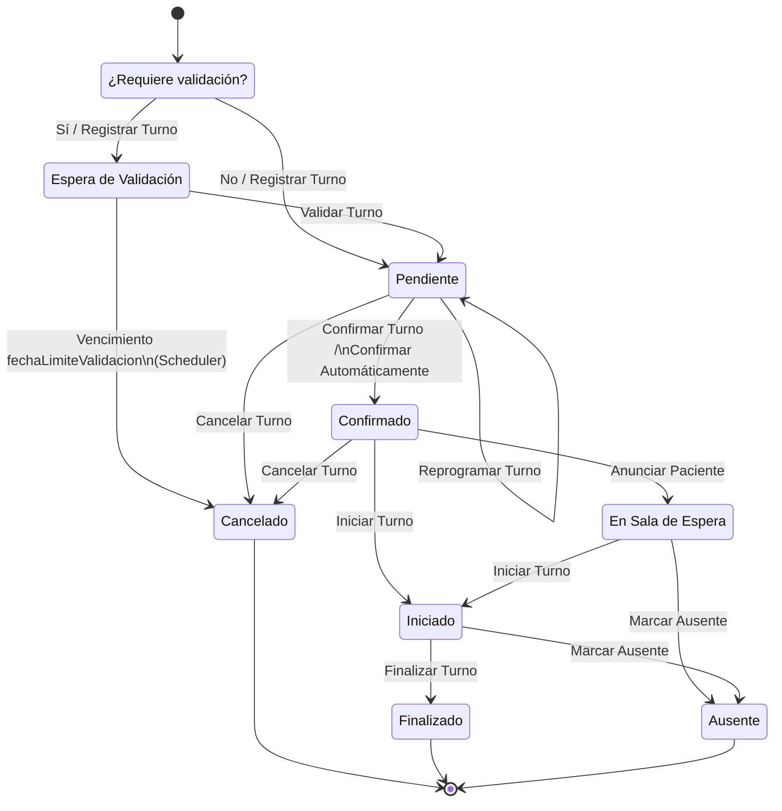

# Diagrama de Transición de Estados — Entidad `Turno`

## 1. Diagrama

## 2. Estados

| Estado | Tipo | Descripción |
|---|---|---|
| **(inicio)** | pseudo-estado | Punto de entrada; se evalúa la decisión `¿Requiere validación?` antes de asignar el primer estado real |
| **Espera de Validación** | intermedio | El turno fue registrado pero requiere una validación manual/adicional antes de quedar disponible como `Pendiente` |
| **Pendiente** | intermedio | Turno registrado y válido, a la espera de confirmación por parte del paciente o del sistema |
| **Confirmado** | intermedio | El paciente (o el sistema, automáticamente) confirmó la asistencia |
| **En Sala de Espera** | intermedio | El paciente se anunció físicamente y está esperando ser atendido |
| **Iniciado** | intermedio | La atención comenzó |
| **Finalizado** | **final** | La atención terminó con éxito |
| **Cancelado** | **final** | El turno fue dado de baja, ya sea por el paciente, por el sistema o por vencimiento de un plazo |
| **Ausente** | **final** | El paciente no se presentó (o no fue anunciado a tiempo) |

## 3. Transiciones y explicación

### 3.1 Alta y validación inicial

| Transición | Evento | Explicación |
|---|---|---|
| `(inicio) → ¿Requiere validación?` | — | Decisión de negocio evaluada al registrar el turno (ej. según prestación, obra social, o si requiere revisión de un administrador) |
| `¿Requiere validación? → Pendiente` | No / Registrar Turno | Si no requiere validación, el turno nace directamente en `Pendiente` |
| `¿Requiere validación? → Espera de Validación` | Sí / Registrar Turno | Si requiere validación, el turno nace en `Espera de Validación` y queda bloqueado hasta que un usuario interno lo revise |
| `Espera de Validación → Pendiente` | Validar Turno | Un usuario interno valida el turno manualmente y lo libera a `Pendiente` |
| `Espera de Validación → Cancelado` | Vencimiento de `fechaLimiteValidacion` (Scheduler — Cancelar Turnos No Validados) | Si nadie lo valida antes del plazo, un proceso automático lo cancela |

### 3.2 Ciclo de vida en `Pendiente`

| Transición | Evento | Explicación |
|---|---|---|
| `Pendiente → Pendiente` | Reprogramar Turno | Self-loop: cambia fecha/horario del turno sin cambiar de estado. Sujeto a `tiempoToleranciaReprogramacion` de la `Prestación` (anticipación mínima) |
| `Pendiente → Confirmado` | Confirmar Turno / Confirmar Automáticamente | El paciente confirma manualmente (por WhatsApp) o el sistema lo confirma automáticamente según configuración. Sujeto a `fechaLimiteConfirmacion` |
| `Pendiente → Cancelado` | Cancelar Turno | Baja del turno. Sujeto a `tiempoToleranciaCancelacion` (anticipación mínima para poder cancelar) |

### 3.3 Ciclo de vida en `Confirmado`

| Transición | Evento | Explicación |
|---|---|---|
| `Confirmado → Cancelado` | Cancelar Turno | El turno confirmado también puede cancelarse, con la misma restricción de tolerancia que desde `Pendiente` |
| `Confirmado → En Sala de Espera` | Anunciar Paciente | El paciente llega físicamente y se anuncia. Sujeto a la ventana `fechaLimiteAnuncioTemprano` (no anunciarse demasiado antes) y `tiempoToleranciaAnuncio` (no demasiado tarde) |
| `Confirmado → Iniciado` | Iniciar Turno | Camino directo si el sistema no exige el paso por sala de espera (ej. turno virtual) |

### 3.4 Sala de espera y atención

| Transición | Evento | Explicación |
|---|---|---|
| `En Sala de Espera → Iniciado` | Iniciar Turno | El médico comienza la atención del paciente que está esperando |
| `En Sala de Espera → Ausente` | Marcar Ausente | El paciente se anunció pero nunca fue atendido dentro del margen aceptable (o el médico lo marca ausente manualmente) |
| `Iniciado → Finalizado` | Finalizar Turno | Cierre exitoso de la atención |
| `Iniciado → Ausente` | Marcar Ausente | Caso borde: el turno se marcó iniciado pero se determina que el paciente no está realmente presente |

## 4. Notas de implementación

- **Estado activo**: no se guarda como campo en `Turno`, se determina vía `HistoricoEstadoTurno`: el registro activo es el que tiene `fechaHoraFin` vacío.
- **Guardas de tiempo**: toda transición sensible a plazos (`Confirmar`, `Cancelar`, `Reprogramar`, `Validar`, `Anunciar Paciente`) valida `now()` contra un campo `fechaLimiteX` de `Turno`, calculado una única vez a partir de `horaTurno ± Prestación.tiempoToleranciaX` (leída vía `MédicoPrestación`, ya que `Turno` no tiene FK directa a `Prestación`).
- **Sin disparo por cronjob salvo un caso**: la única transición que dispara un proceso automático (scheduler) es `Espera de Validación → Cancelado` por vencimiento de `fechaLimiteValidacion`. El resto de las transiciones quedan a criterio del agente/usuario, no hay auto-transición temporizada.
- **La tardanza no es un estado nuevo**: se maneja como guarda (condición) sobre la transición `Anunciar Paciente`, no como un estado adicional en el DTE.
